# SOC Platform for HLS4ML Unified Back-end Tutorial

- This section exemplifies how to create the platform for HLS4ML backend

## 1. create Vivado Project

- create common vivado project BUT YOU MUST click ```Project is extensible to vitis platform```

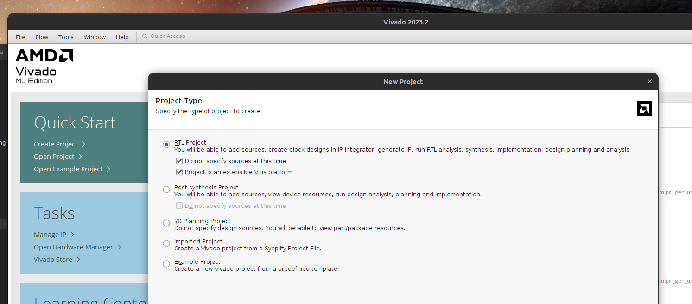


## 2. Create Block Diagram

The block name MUST be ```vitis_diagram``` only

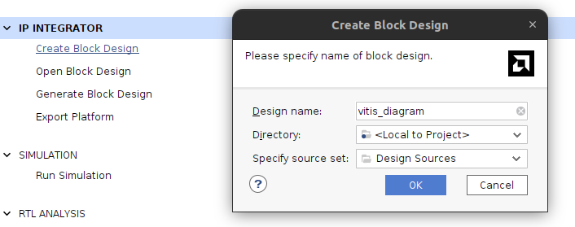

## 3. Build Block Diagram

The block diagram should be like in this picture

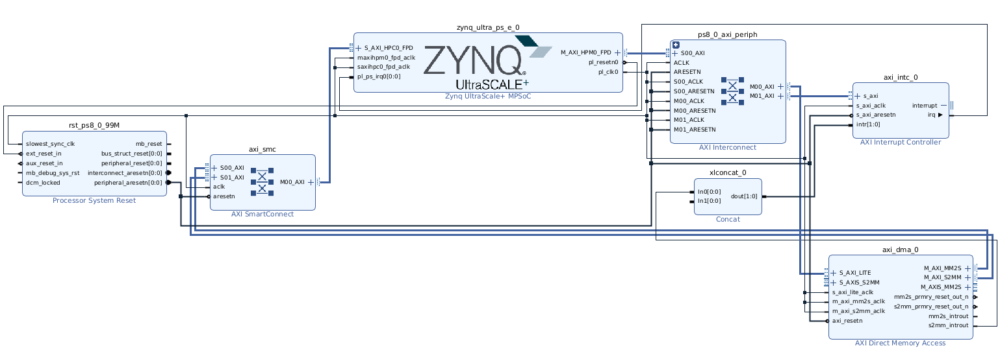


## 4. Platform Setup


- AXI Port

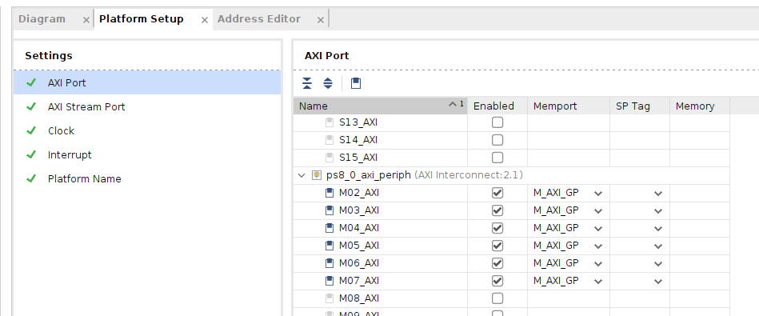
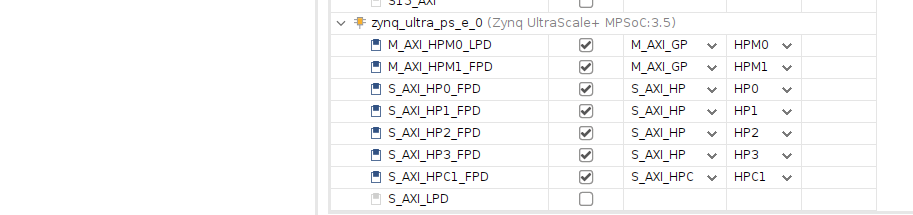


- AXI Stream Port

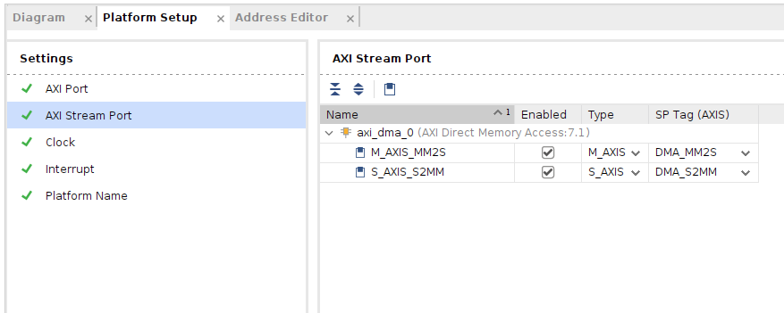

- Clock

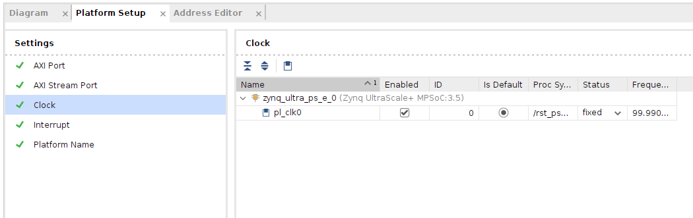

- Interrupt

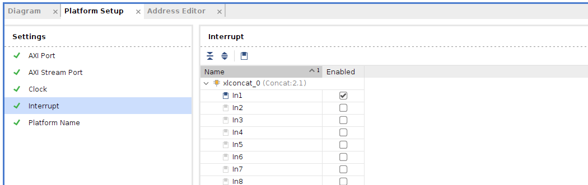


## 5. Create HDL wrapper and Generate Output Product

Click HDL wrapper and Generate Output Product

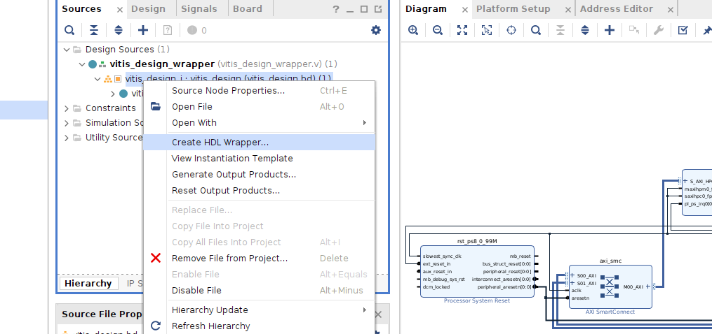

## 6. Generate Bit Stream File


## 7. Export Platform


### 7.1 check is there dcp file exist
- IF DCP FILE EXIST AT UTILS_1, YOU MUST DELETE IT BEFORE NEXT STEP

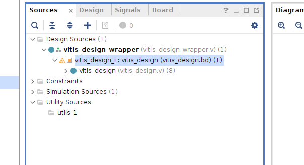

### 7.2 begin export

- follow the popup window, it will generate the XSA file. put the XSA wherever you want
- the XSA file can be used instead XPFM file.

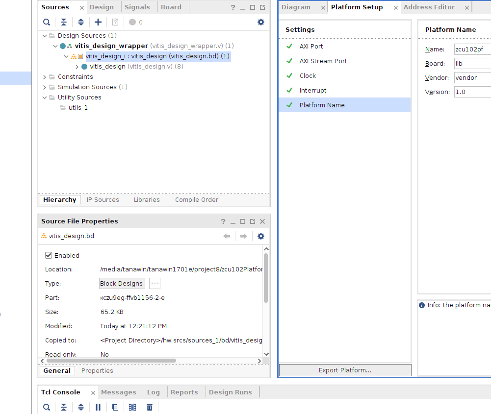